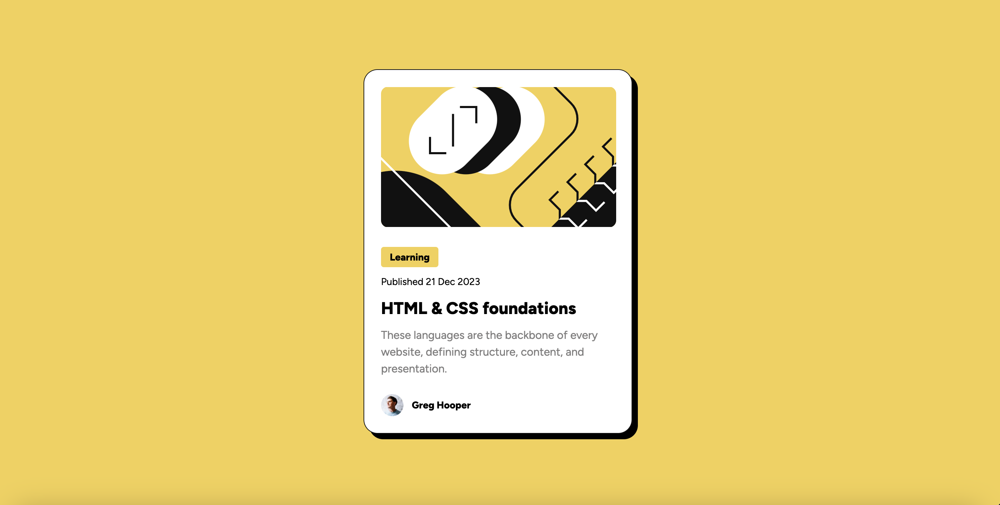

# Frontend Mentor - Blog Preview Card

This is a solution to the [Blog Preview Card challenge on Frontend Mentor](https://www.frontendmentor.io/challenges/blog-preview-card-ckPaj01IcS/hub). 

## Table of contents

- [Overview](#overview)
  - [The Challenge](#the-challenge)
  - [Screenshot](#screenshot)
  - [Links](#links)
  - [Built with](#built-with)
- [Author](#author)

## Overview

### The Challenge

Users should be able to:

- View the optimal layout depending on their device's screen size
- See hover states for interactive elements

### Screenshot

### Links

- Solution URL: 
- Live Site URL: https://vanessa-ayer.github.io/blog-preview-card-main/

### Built with

- Semantic HTML5 markup
- CSS custom properties
- CSS media queries
- Flexbox

## Author

- Frontend Mentor - [vanessa-ayer](https://www.frontendmentor.io/profile/vanessa-ayer)
